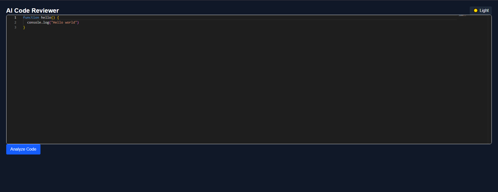
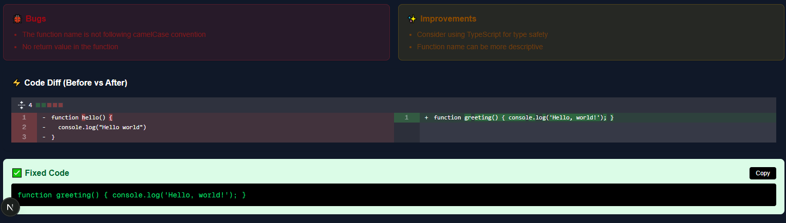

# 🚀 AI Code Reviewer & Bug Fixer

An AI-powered developer tool that analyzes code, detects bugs, suggests improvements, and generates optimized code in real time.

---

## 🧠 Features

- 📝 Code Editor (Monaco Editor)
- 🤖 AI Code Analysis (Groq LLM)
- 🐞 Detects bugs in code
- ✨ Suggests improvements
- ⚡ Code Diff Viewer (before vs after)
- 📋 Copy Fixed Code with one click
- 🌙 Dark / Light Mode Toggle
- 🎯 Clean and responsive UI

---

## 🖥️ Tech Stack

- **Frontend:** Next.js, React, Tailwind CSS  
- **Editor:** Monaco Editor  
- **AI Integration:** Groq API (LLaMA models)  
- **Diff Viewer:** react-diff-viewer-continued  

---

## 📸 Screenshots

### 🔹 Editor + Analysis


### 🔹 Diff Viewer


---

## ⚙️ Installation & Setup

```bash
# Clone the repository
git clone https://github.com/jaiteshg/AI-Code-Reviewer.git

# Navigate to project
cd ai-code-reviwer

# Install dependencies
npm install

# Create environment file
touch .env.local
```

Add your API key:

```env
GROQ_API_KEY=your_api_key_here
```

Run the project:

```bash
npm run dev
```

Open in browser:

```
http://localhost:3000
```

---

## 🧪 How It Works

1. Write or paste your code in the editor  
2. Click **Analyze Code**  
3. AI analyzes and returns:
   - Bugs 🐞  
   - Improvements ✨  
   - Optimized code ✅  
4. View differences using the Diff Viewer  
5. Copy improved code instantly  

---

## 🎯 Use Cases

- Beginners learning coding  
- Developers debugging code faster  
- Improving code quality  
- Understanding best practices  

---


## 🙌 Acknowledgements

- Groq (AI inference)
- Next.js (framework)
- Monaco Editor (code editor)


⭐ Don’t forget to star the repo if you found it useful!